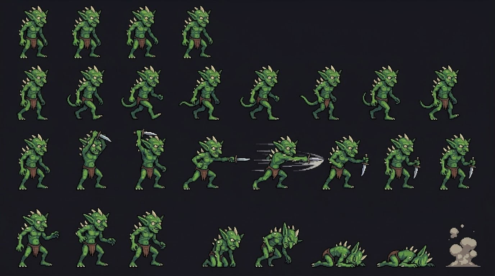

# Not your Dungeon


RPG tático por turnos em 2D, feito em **Godot**. O jogador comanda os **monstros da masmorra** contra as inquisições humanas, lutando pela liberdade de cada monstro escolher o próprio destino.

> Projeto acadêmico. O GDD completo está em [`docs/GDD_Not_your_Dungeon.docx`](docs/GDD_Not_your_Dungeon.docx) e o resumo em [`docs/GDD.md`](docs/GDD.md).

## Personagens (pixel art atual)


| Personagem | Papel | Atributo | Habilidade única | Referência |
|---|---|---|---|---|
| **Spike** | tanque | vida adicional | Muralha de Tronco | [ogro com tronco](arte/referencias/spike/spike_referencia.png) |
| **Gordot** | veloz / veneno | age primeiro | Martelada Venenosa | [orc com martelo](arte/referencias/gordot/gordot_referencia.jpg) |
| **Thyr** | mago | ganha mais experiência | Chama do Núcleo | [espectro de fogo](arte/referencias/thyr/thyr_referencia.png) |
| **Zork** | chefe da masmorra (não jogável) | — | — | [rei-sombra](arte/referencias/zork/zork_referencia.png) |

Os sprites (fundo transparente) ficam em [`arte/personagens/monstros/`](arte/personagens/monstros/). Eles são gerados **a partir das imagens de referência** pelo script [`ferramentas/converter_referencias.py`](ferramentas/converter_referencias.py), que remove o fundo, reduz para a resolução do sprite e aplica um tom mais sombrio, com olhos brilhando, sangue e veneno. Para refazer, rode `python ferramentas/converter_referencias.py`. As referências, incluindo os mapas de cenário, estão em [`arte/referencias/`](arte/referencias/).

> **Origem das referências:** os sprites são derivados diretamente das imagens de referência. Se essas imagens forem de outros artistas, citem a fonte ou redesenhem os sprites antes de qualquer uso fora do contexto acadêmico.

## Arte conceitual (primeira versão)

Rascunhos visuais da primeira fase do projeto. **Atenção:** nesta versão o Spike era um goblin e o Gordot um ogro roxo. A aparência atual é a da seção acima. Ficam em [`arte/conceitos/`](arte/conceitos/).

### Menu inicial


### Mapa das masmorras


### Personagens


### Sala do trono (Fase 1, Tela 1)


### Combate


### Grupo e inventário


### Itens e armas
| Itens | Armas |
|---|---|
|  |  |

## Folhas de animação (primeira versão)

### Spike


### Gordot


### Zork


### Mercenários (Lacaio e Líder)


## Equipe

- Cesar Sapha
- Vitor Souza
- Tales Fernandes
- Pietro Pelozato Maeda

## Estrutura do repositório

| Pasta | Conteúdo |
|---|---|
| `docs/` | GDD e documentação |
| `arte/personagens/monstros/` | Monstros jogáveis (Spike, Gordot, Thyr, Zork...) |
| `arte/personagens/herois/` | Heróis humanos |
| `arte/inimigos/` | Mercenário Lacaio, Mercenário Líder... |
| `arte/cenarios/masmorra_1/` | Caverna Destruída |
| `arte/ui/` | Interface, caixas de diálogo, ícones |
| `arte/conceitos/` | Rascunhos e concept art (primeira versão) |
| `arte/referencias/` | Imagens de referência de cada personagem e do cenário |
| `ferramentas/` | Script que gera a pixel art dos personagens |
| `animacoes/` | Sprite sheets e arquivos de animação |
| `audio/` | Músicas e efeitos sonoros |

## Protótipo atual: combate por turnos

Feito em **Godot 4.7.2**. Para jogar, abra a Godot, clique em **Importar**, selecione o `project.godot` desta pasta e aperte **F5**.

Ele reproduz a **Fase 1, Tela 5** do GDD: Spike e Gordot contra 2 Mercenários Lacaios e o Mercenário Líder (chefe).

- Ordem de turnos pela velocidade. O Gordot **sempre age primeiro**.
- O Spike é o tanque: tem **+20% de vida** e a **Muralha de Tronco**, que atrai os ataques inimigos por 2 turnos com 30% menos dano.
- O Gordot envenena com a **Martelada Venenosa**.
- Ações disponíveis: Atacar, Defender, Especial (gasta SP), Item (Poção) e Fugir. Não dá para fugir porque é batalha de chefe.
- **Combo:** o Gordot usa *Martelada Venenosa* e, na mesma rodada, o Spike usa *Esmagar com Tronco*. Isso dispara o **Esmagamento Tóxico**, que acerta todos os inimigos.
- Ainda não implementado (previsto no GDD): MP para magias, stagger, moral, crítico com tempo e o Thyr no combate.

| Arquivo | Para que serve |
|---|---|
| `scripts/combate/banco_dados.gd` | Atributos, habilidades e combos. **Balanceamento é aqui.** |
| `scripts/combate/combate.gd` | Turnos, menus e regras do combate |
| `scripts/combate/combatente.gd` | Uma unidade em campo (vida, dano, desenho) |

**Arte:** Spike e Gordot já aparecem com a pixel art. Os mercenários ainda são retângulos. Se um PNG **com fundo transparente** for salvo num destes caminhos, ele aparece sozinho no jogo:

- `arte/inimigos/mercenario_lacaio.png`, `arte/inimigos/mercenario_lider.png`
- `arte/cenarios/masmorra_1/fundo_combate.png` (fundo, 1280x720)

**Teste automático** (simula uma batalha inteira e mostra o resultado no terminal):

```
Godot_v4.7.2-stable_win64_console.exe --headless --path . -- --autoteste
```

## Controles

| Tecla | Ação |
|---|---|
| Setas / WASD | Andar pelo cenário / navegar menus |
| Z | Confirmar / interagir |
| X | Voltar |

## Convenção de nomes dos arquivos de arte

`personagem_acao_direcao.png`. Exemplos: `spike_idle.png`, `spike_andar_direita.png`, `mercenario_lacaio_ataque.png`. Use letras minúsculas e não use acentos nem espaços.
